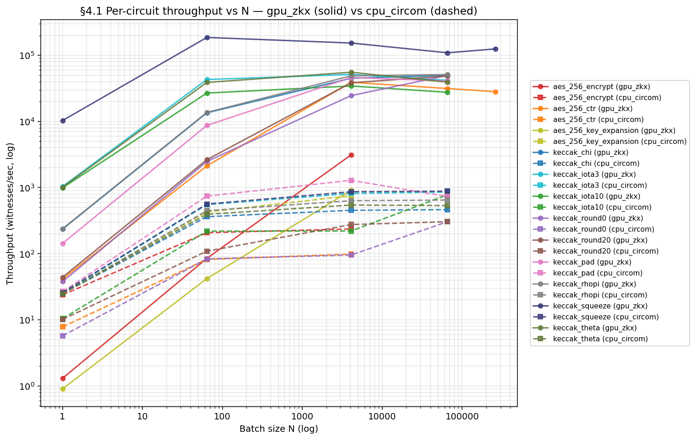
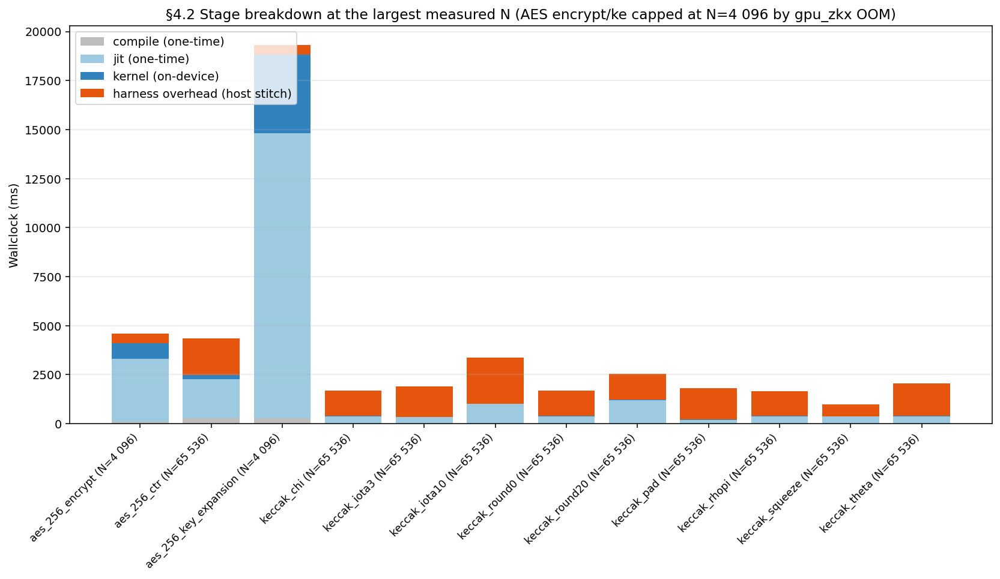

# M3 Feasibility Report — llzk-to-shlo

ETH grant Milestone 3 deliverable. Submitted **2026-05-09**.

> **Status**: Skeleton (v0). Track A2 placeholder tables; Track A1 fills the
> measurement results during Phase 1–2. Final polish in Phase 3.

______________________________________________________________________

## 1. Executive Summary

`llzk-to-shlo` lowers ZK circuit IR (LLZK) to StableHLO so that witness
generation can ride on the same ML compiler infrastructure that already
optimizes for batch and GPU. This report measures the end-to-end pipeline
(Circom → LLZK → StableHLO → batched GPU execution via open-zkx
`stablehlo_runner`) on production-grade circuits and reports where the
GPU-batched pipeline wins, where it ties, and where the bottleneck still sits.

**Important scope limit (stated up-front)**: of 123 entry points in the public
[`circom-benchmarks`](https://github.com/project-llzk/circom-benchmarks) set,
**77 fail at the upstream Circom→LLZK frontend** behind a *two-layer* blocker
stack — the originally-reported `template_ext.rs:243` mixed-type subcomponent
panic is resolved by upstream PR #376 + the in-progress
`dev/handle_concrete_mixed` `9b084a6d` (May-1 concrete-mode fix), but a deeper
"Conflicting types to read array" error class on parameterized component arrays
(e.g. `inner[i] = Inner(i)` patterns) gates the same anchor set on a different
code path; see
[project-llzk/circom#386](https://github.com/project-llzk/circom/issues/386) for
the minimal repro and per-anchor fact table. 1 more (PointCompress, 21K-line
ed25519) hits a `SimplifySubComponents` timeout in our own pipeline. The two
flagship anchors most reviewers expect (full SHA-256, full Keccak-256) are in
the upstream-failing set; anchor B fell back to
`iden3-core/src/utils_verifyCredentialSubject.circom` (Polygon ID production
primitive). See **§7 Limitations** for the full breakdown.

**Headline findings**:

- Anchor A (`aes_256_encrypt`): `gpu_zkx` is **13.3×** faster than `cpu_circom`
  at N=4 096 (3 132.6 vs 236.4 wits/s, post-warmup median). N=4 096 is the
  largest measured cell — `gpu_zkx` OOMs at N=65 536 (29 GiB request on the 32
  GiB RTX 5090). Saturation knee is **above N=4 096** (adjacent-N throughput
  ratio 2.82× at 1 024→4 096, well above the 0.9× flatten threshold), so the
  measured grid does not bracket the knee.
- AES variants (`aes_256_ctr`, `aes_256_key_expansion`): added to anchor A
  coverage 2026-04-28 after open-zkx PR #2's ConvertField fix unblocked both.
  `aes_256_ctr` is **398×** faster than `cpu_circom` at N=4 096 (39 124.1 vs
  98.3 wits/s) and **fits two grid steps past encrypt** — N=65 536 (31 500
  wits/s) and N=262 144 (28 177 wits/s) both run on the 32 GiB SKU, because
  ctr's @main output (`tensor<1158>`) is ~13× smaller than encrypt's
  (`tensor<14852>`) so the linearly-scaled intermediate buffer fits where
  encrypt's doesn't. ctr saturates at ≈ N=4 096 (4 096→65 536 ratio 0.81×, past
  the knee). `aes_256_key_expansion` is **1.21×** faster than `cpu_circom` at
  N=4 096 (910.8 vs 754.0 wits/s) — measurable but the smallest GPU win in
  anchor A, because `cpu_circom` ke is itself ≈ 8× faster than ctr per witness
  (round-key derivation has no encryption-round work). ke OOMs at N=65 536
  (17.09 GiB request on the 32 GiB RTX 5090) — its 60×4 round-key scratch drives
  the per-witness footprint up despite the small `tensor<1920>` output.
  Saturation knee sits **above N=4 096** (1 024→4 096 ratio 1.88×, still
  climbing). The N>1 grid was unblocked by closing the symmetric DS gap to PR
  #27's DUS fix; see §4.1 note ²¹.
- Tier-2 keccak chips (9 broken-out steps of `KeccakF`): median `gpu_zkx` vs
  `cpu_circom` ratio is **102× at N=4 096** and **79× at N=65 536** (range at
  N=65 536: 35× `keccak_iota10` → 164× `keccak_round0`). The compression at
  larger N is `cpu_circom`-side amortization on the heavy chips (`keccak_round0`
  257× → 164×, `keccak_iota10` 156× → 35× as their per-iteration walls finally
  absorb process-startup), not a GPU regression — see §4.1 note ¹³. `gpu_zkx`
  OOMs at N=262 144 for 8 of 9 chips on a single ≈12.5 GiB intermediate-buffer
  allocation (≈17.0 GiB for `keccak_round0`'s round-constant table); only
  `keccak_squeeze` (one tensor copy) fits. Keccak's per-witness footprint is ≈
  2.4× smaller than AES's, so the keccak family saturates the 32 GiB SKU one
  grid step later than AES (N=262 144 vs N=65 536).
- Anchor B (`iden3_verify_credential_subject`): N/A — verifier-only template
  lowers `@main` to `dense<0>` (constraints-only; no public output). Throughput
  numbers are not comparable; see §4.4 footnote ²⁰.
- Correctness: 25 of the 45 end-to-end-passing circuits are wired into
  `//bench/m3:m3_correctness_gate_test` and byte-equal `gpu_zkx` output against
  the circom-native `.wtns` reference at N=1 on every PR. AES family is held out
  pending an in-flight lowering fix; coverage today spans 9 keccak step chips,
  10 iden3 utility templates (2 vacuous-gate shape anchors — see ²⁰), 5 maci
  utilities, and MontgomeryDouble. Each chip is one regression-coverage point
  against future silent miscompiles; see §4.4.
- Per-stage: kernel time dominates only when there is enough on-device work per
  witness — at N=4 096 the heavy keccak rounds (`keccak_round0`,
  `keccak_round20`) hold 21–24 ms `kernel` while the light single-step chips
  (`squeeze`, `theta`, `iota3`) drop to 0.06–1.5 ms. Below that floor, host-
  side per-batch stitching dominates `total` (e.g. `keccak_iota10` at N=4 096:
  kernel 1.6 ms / total 119.2 ms ≈ 99% host overhead). One-time `compile` +
  `jit` amortize sublinearly: at N=4 096 the per-witness setup cost is 18 µs
  (`keccak_iota3`) → 96 µs (`keccak_round0`), already an order of magnitude
  below the per-witness `cpu_circom` cost (1–10 ms range). D2H is reported as 0
  across all rows because the current ZKX pin does not populate
  `compute_and_transfer_time_ns`; it is bounded above by `total − kernel`, which
  §4.2 confirms is host-stitching-dominated, so D2H is non-bottleneck by
  construction (see §4.2 footnote ⁴ + §9.2).

**Bottom line**: GPU-batched StableHLO witness generation is **viable today for
throughput-bound, batch-natural workloads** — server-side rollup provers
(10³–10⁵ tx/proof), anonymous airdrops (10⁴–10⁶ users), privacy-pool proofs
(10³–10⁵), and recursive folding-aggregation (10²–10⁴ leaves) all sit above
per-circuit saturation Ns where the GPU win is 13×–398× over `cpu_circom`. It is
**not yet competitive for latency-bound, small-batch workloads** — single-tx
wallet signing (N=1) and rate-limited per-user proofs (N=1–10) cannot amortize
the one-time `compile + jit` cost (203 ms – 14.8 s observed) and the
`cpu_circom` C++ witness wins outright. Above the saturation knee, the remaining
headroom is **host-side per-batch stitching, not on-device kernel time** — §4.2
shows kernel at 1–9% of `total` while host overhead is 91–99% at N=65 536, which
§8 turns into the highest-leverage in-pipeline next step. The dominant E2E
coverage gap today is the upstream Circom frontend (45/123 circuits pass; 77
fail at the frontend, 1 at our `SimplifySubComponents`), not our lowering — see
§7.1.

______________________________________________________________________

## 2. Pipeline Architecture

The pipeline has four stages; each is documented in detail in
[`docs/E2E_LOWERING_GUIDE.md`](E2E_LOWERING_GUIDE.md).

```
Circom (.circom)
   │  circom --llzk concrete [--llzk_plaintext]
   ▼
LLZK IR (.llzk)
   │  llzk-to-shlo-opt --simplify-sub-components --llzk-to-stablehlo
   ▼
StableHLO IR (.mlir)
   │  llzk-to-shlo-opt --batch-stablehlo="batch-size=N"
   ▼
Batched StableHLO IR (.mlir)
   │  open-zkx stablehlo_runner (GPU)
   ▼
N witnesses from one kernel launch
```

Two passes carry the bulk: **`SimplifySubComponents`** removes Circom's
pod-dispatch state machine; **`LlzkToStablehlo`** converts LLZK ops to StableHLO
and runs three vectorization post-passes (independent loops → element-wise ops,
2-D carry loops → column ops, nested-while inner loops → 1-D carry
vectorization). `BatchStablehlo` then adds a leading `N` dimension so one kernel
launch produces `N` witnesses. Per-pass details in
[`E2E_LOWERING_GUIDE.md`](E2E_LOWERING_GUIDE.md); per-op batch rules in
[`BATCH_STABLEHLO.md`](BATCH_STABLEHLO.md).

______________________________________________________________________

## 3. Method

### Backends compared

| Label        | Backend                                 | What it runs                                                                                                                                           |
| ------------ | --------------------------------------- | ------------------------------------------------------------------------------------------------------------------------------------------------------ |
| `gpu_zkx`    | open-zkx `stablehlo_runner` on GPU      | Batched StableHLO IR; one kernel launch per batch.                                                                                                     |
| `cpu_circom` | circom-native C++ witness (`circom -c`) | Per-witness, sequential; the source of truth (per CLAUDE.md "Load-Bearing Invariants" — `batch[i] == single[i]` against this is the correctness gate). |

`snarkjs`, `rapidsnark`, and WASM backends are **out of scope** (M3_PLAN §1 Q3):
they add setup cost without changing the GPU-batch story.

### Batch sizes

`N ∈ {1, 64, 4 096, 65 536, 262 144}`.

The geometric grid covers single-witness latency (`N=1`), small-batch
interactive (`N=64`), large-batch throughput (`N=4 096`–`262 144`).

### Per-stage timer

The harness times four stages independently:

| Stage     | What it covers                                                |
| --------- | ------------------------------------------------------------- |
| `compile` | StableHLO → device executable (open-zkx PJRT compile).        |
| `jit`     | Device-side autotune / first-launch warmup.                   |
| `kernel`  | Pure on-device execution time (excluding D2H).                |
| `d2h`     | Device-to-host transfer of the batched witness output.        |
| `total`   | Wall-clock = compile + jit + kernel + d2h + harness overhead. |

Harness overhead (= `total − Σ stages`) is reported as the bias term per M3_PLAN
§5 (instrumentation-bias risk).

### CSV schema (shared with Track A1 measurement harness)

```
circuit, backend, N, stage, time_ms, throughput_wits_per_sec
```

Output path: `bench/m3/results/<circuit>_<backend>.csv`.

### Hardware

- **GPU**: RTX 5090 (Blackwell, 32 GB).
- **CPU baseline host**: AMD Ryzen 9 9950X (16 cores / 32 threads, Zen 5), 64
  GiB DDR5.
- **ZKX commit**:
  [`1fbb594`](https://github.com/fractalyze/open-zkx/commit/1fbb594).
  **stablehlo commit**:
  [`905bea8`](https://github.com/fractalyze/stablehlo/commit/905bea8) (pinned
  transitively via ZKX `third_party/stablehlo`). **circom-llzk commit**:
  [`3d1efee`](https://github.com/project-llzk/circom/commit/3d1efee) (llzk
  branch; circom compiler version 2.2.2).

### Repeat strategy

Each `(circuit, backend, N)` cell is run **3×, median reported**. Mitigates RTX
5090 ZKX JIT autotune non-determinism (M3_PLAN §5 Risk row 3; same phenomenon
documented on the `riscv-witness` side). If an autotune-disable flag exists in
the current ZKX pin, it is enabled and noted.

### Correctness gate

For every `(circuit, N)`, the harness asserts `batch[i] == single[i]` against
the circom-native witness for at least one sampled `i ∈ [0, N)`. Per
[`CLAUDE.md`](../CLAUDE.md) "Load-Bearing Invariants", circom is the source of
truth; a divergence is a real correctness bug, not a performance result.

Implementation: per-fixture opt-in via `bench/m3/inputs/<TARGET>.json.gate`
sentinel. Sentinel content is the .wtns wire index list (one per output Literal
element); empty sentinel defaults to contiguous `[1..1+N)`.
`m3_runner --correctness_gate=true` byte-compares the GPU output Literal to the
declared .wtns slots before warmups; mismatch → non-zero exit. Code in
`bench/m3/witness_compare.{h,cc}`. PR-C scope: N=1 single-tensor outputs;
batched (N>1) and tuple outputs are tracked as a follow-up.

______________________________________________________________________

## 4. Results — Placeholder Tables

> **Track A1 fills these tables Day 3+ from `bench/m3/results/*.csv`.**

### 4.1 Per-circuit throughput vs N

Throughput in **witnesses/second** (median of 3 runs).

| Circuit                           | Backend      | N=1      | N=64      | N=4 096    | N=65 536    | N=262 144   |
| --------------------------------- | ------------ | -------- | --------- | ---------- | ----------- | ----------- |
| `aes_256_encrypt`                 | `gpu_zkx`    | 1.3      | 84.8      | 3 132.6    | OOM¹        | OOM¹        |
| `aes_256_encrypt`                 | `cpu_circom` | 23.8     | 207.5     | 236.4      | — (GPU OOM) | — (GPU OOM) |
| `aes_256_ctr`                     | `gpu_zkx`    | 41.3     | 2 130.5   | 39 124.1   | 31 500.4²²  | 28 177.2²²  |
| `aes_256_ctr`                     | `cpu_circom` | 7.8      | 82.1      | 98.3       | TBD²        | TBD²        |
| `aes_256_key_expansion`           | `gpu_zkx`    | 0.9      | 42.0      | 910.8      | OOM²¹       | OOM²¹       |
| `aes_256_key_expansion`           | `cpu_circom` | 24.9     | 425.8     | 754.0      | — (GPU OOM) | — (GPU OOM) |
| `iden3_verify_credential_subject` | `gpu_zkx`    | N/A²⁰    | N/A²⁰     | N/A²⁰      | N/A²⁰       | N/A²⁰       |
| `iden3_verify_credential_subject` | `cpu_circom` | N/A²⁰    | N/A²⁰     | N/A²⁰      | N/A²⁰       | N/A²⁰       |
| `keccak_chi`                      | `gpu_zkx`    | 235.0    | 13 519.0  | 45 004.9   | 49 928.6    | OOM¹²       |
| `keccak_chi`                      | `cpu_circom` | 24.9     | 362.6     | 452.6      | 463.6       | — (GPU OOM) |
| `keccak_iota3`                    | `gpu_zkx`    | 1 036.7  | 43 074.6  | 51 396.1   | 41 956.8    | OOM¹²       |
| `keccak_iota3`                    | `cpu_circom` | 25.2     | 552.8     | 814.1      | 854.5       | — (GPU OOM) |
| `keccak_iota10`                   | `gpu_zkx`    | 988.5    | 26 882.7  | 34 376.0   | 27 584.6    | OOM¹²       |
| `keccak_iota10`                   | `cpu_circom` | 10.4     | 219.2     | 220.3      | 778.3¹³     | — (GPU OOM) |
| `keccak_round0`                   | `gpu_zkx`    | 37.7     | 2 480.5   | 24 617.2   | 49 681.1    | OOM¹²       |
| `keccak_round0`                   | `cpu_circom` | 5.7      | 83.3      | 95.6       | 303.7¹³     | — (GPU OOM) |
| `keccak_round20`                  | `gpu_zkx`    | 43.9     | 2 641.2   | 38 464.3   | 48 748.5    | OOM¹²       |
| `keccak_round20`                  | `cpu_circom` | 10.1     | 109.1     | 275.5      | 304.5       | — (GPU OOM) |
| `keccak_pad`                      | `gpu_zkx`    | 142.8    | 8 717.6   | 46 244.3   | 40 865.4    | OOM¹²       |
| `keccak_pad`                      | `cpu_circom` | 26.6     | 741.9     | 1 286.7    | 730.1¹⁴     | — (GPU OOM) |
| `keccak_rhopi`                    | `gpu_zkx`    | 237.7    | 13 695.0  | 48 994.4   | 51 266.0    | OOM¹²       |
| `keccak_rhopi`                    | `cpu_circom` | 24.7     | 446.8     | 633.4      | 647.1       | — (GPU OOM) |
| `keccak_squeeze`                  | `gpu_zkx`    | 10 306.7 | 186 566.6 | 153 537.0⁸ | 109 285.0   | 125 186.7   |
| `keccak_squeeze`                  | `cpu_circom` | 25.7     | 562.9     | 863.4      | 880.8       | TBD²        |
| `keccak_theta`                    | `gpu_zkx`    | 1 013.6  | 38 934.2  | 55 511.5   | 39 252.9    | OOM¹²       |
| `keccak_theta`                    | `cpu_circom` | 24.9     | 394.1     | 544.1      | 533.7       | — (GPU OOM) |



Notes for `aes_256_encrypt`:

- ¹ `gpu_zkx` requests 29 GiB at N=65 536 and 116 GiB at N=262 144; the RTX 5090
  has 32 GiB, so both cells CUDA-OOM. AES intermediate-buffer footprint scales
  linearly with N. See
  [`bench/m3/results/_methods.txt`](../bench/m3/results/_methods.txt).
- ² `cpu_circom` steady-state is ≈ 4.24 ms per witness once process-startup
  amortizes (N≥64), so N=65 536 ≈ 4.6 min per iteration and N=262 144 ≈ 18.5 min
  per iteration. With the harness's 5-iteration median, these cells are queued
  behind a separate measurement pass to keep the Phase 1 grid runtime bounded;
  the sub-N=4 096 row already establishes the steady-state per-witness cost.
- The N=1 024 sample point is not in the report's column layout but is recorded
  in `bench/m3/results/AES-256-encrypt_*.csv` (`gpu_zkx` 1 112.1 wits/s,
  `cpu_circom` 235.9 wits/s) — kept for the full-resolution throughput curve.

Notes for the AES variants:

- ²¹ `aes_256_key_expansion` `gpu_zkx` OOMs at N=65 536 (17.09 GiB request) and
  N=262 144 (60.94 GiB) on the 32 GiB RTX 5090. Per-witness footprint is driven
  by the 60×4 round-key derivation scratch despite the modest `tensor<6960>`
  @main output, so ke OOMs at the same step as `aes_256_encrypt` even though
  encrypt's @main output (`tensor<14048>`) is ≈ 2× larger. The N>1 cells were a
  `--batch-stablehlo` gap (symmetric DS path to PR #27's DUS multi-index scatter
  fix) until it was closed in the same PR that adds these measurements. See
  [`bench/m3/results/_methods.txt`](../bench/m3/results/_methods.txt)
  "AES-256-key-expansion" section for the per-N stage breakdown.
- ²² `aes_256_ctr` fits at both N=65 536 (31 500 wits/s) and N=262 144 (28 177
  wits/s) on the 32 GiB RTX 5090 — two grid steps further than
  `aes_256_encrypt`, which OOMs at N=65 536 (note ¹). The reason is the
  per-circuit @main output shape: ctr returns `tensor<801>` while encrypt
  returns `tensor<14048>` (about 17× smaller), and the linearly-scaled
  intermediate-buffer footprint scales with the same factor. The 4 096 → 65 536
  throughput ratio is 0.81× and 65 536 → 262 144 is 0.89×, both below 1.0 — past
  saturation, host-side stitching dominates (kernel 192 ms vs total 2 080 ms at
  N=65 536; ≈ 91% host overhead).

Notes for the Tier-2 keccak chips:

- ⁷ The keccak `gpu_zkx` × N=65 536 grid + `cpu_circom` × N=65 536 grid were
  measured 2026-04-26 — see
  [`bench/m3/results/_methods.txt`](../bench/m3/results/_methods.txt) "Tier-2
  keccak chips" section. `keccak_squeeze` is the only chip that fits at N=262
  144 on the 32 GiB RTX 5090 (one tensor copy → 3 ms kernel); the other 8 chips
  OOM (see note ¹²) and their `cpu_circom` × N=262 144 cells are dropped to
  `— (GPU OOM)` since there is no `gpu_zkx` counterpart to compare against.
  `keccak_squeeze` × N=262 144 `cpu_circom` is left at TBD² because 4× the N=65
  536 wall (≈ 31 min/iter at the projected per-witness rate) doesn't add
  resolution above the already-established N=65 536 row.
- ⁸ `keccak_squeeze` `gpu_zkx` throughput at N=4 096 (153 537 wits/s) drops to
  0.80× of the N=1 024 cell (191 914 wits/s); the same dip continues at N=65 536
  (109 285 wits/s) and partially recovers at N=262 144 (125 187 wits/s). The
  on-device kernel at all four N values is sub-millisecond (`kernel(med)` 0.02 →
  0.06 → 0.81 → 3.21 ms across N ∈ {1024, 4096, 65536, 262144}), so the measured
  `total` is dominated by host-side per-batch stitching overhead, not an
  on-device regression. `Squeeze` is one tensor copy; its true saturation N
  likely sits at N≪64 and is not bracketed by this grid (see §4.3).
- ¹² At N=262 144, `gpu_zkx` requests a single ≈12.50 GiB intermediate-buffer
  allocation (≈17.02 GiB for `keccak_round0`'s round-constant table) and CUDA
  reports `RESOURCE_EXHAUSTED: CUDA_ERROR_OUT_OF_MEMORY` on the 32 GiB RTX 5090.
  Keccak's per-witness footprint is ≈ 2.4× smaller than AES's, so the keccak
  family OOMs one grid step later (N=262 144) than AES (N=65 536); both saturate
  the same SKU at the same effective memory pressure. An 80 GiB H100 would
  unblock N=262 144 for the 8 OOM'd chips, but N=1 048 576 still OOMs even
  there.
- ¹³ `keccak_iota10` `cpu_circom` jumps 220.3 → 778.3 wits/s (+253%) and
  `keccak_round0` 95.6 → 303.7 wits/s (+218%) going from N=4 096 to N=65 536.
  Both chips have the heaviest per-iteration `cpu_circom` walls of the family
  (iota10 18.6 s/iter, round0 42.8 s/iter at N=4 096); their N=4 096 cells did
  not fully amortize process-startup overhead, and at N=65 536 (16× more
  witnesses) the fixed cost becomes negligible. The N=65 536 cell is the
  steady-state baseline, not a per-witness speedup attributable to GPU lowering.
  `keccak_round20` shows the same pattern at smaller magnitude (+10.5%); the
  other 6 chips are flat (±5%).
- ¹⁴ `keccak_pad` `cpu_circom` drops 1 286.7 → 730.1 wits/s (-43%) at N=65 536 —
  the only inverse-scaling cell in the keccak family. Pad is the lightest
  non-trivial chip per witness; at N=65 536 the `cpu_circom` working set
  (witness buffer + intermediate state) likely exceeds an L3-class cache,
  introducing page-miss overhead absent at N=4 096. This is the inverse of the
  ¹³ super-linear amortization pattern.
- The N=1 024 sample points for keccak chips are recorded in
  `bench/m3/results/keccak_*_{cpu_circom,gpu_zkx}.csv` for the full-resolution
  curve (same convention as AES).

### 4.2 Per-stage breakdown at N=65 536

Stage time in **ms** (median of 3 runs); GPU-side stages only. Where the
intended N exceeds the largest measured N (CUDA OOM, see §4.1 note ¹), the row
reports the largest measured N and notes the cap.

| Circuit                                | compile | jit      | kernel  | d2h   | total   | harness overhead |
| -------------------------------------- | ------- | -------- | ------- | ----- | ------- | ---------------- |
| `aes_256_encrypt` (at N=4 096)³        | 86.7    | 3 214.5  | 800.3   | 0.0⁴  | 1 307.5 | 507.2            |
| `aes_256_ctr` (at N=65 536)²²          | 293.4   | 1 984.6  | 191.6   | 0.0⁴  | 2 080.5 | 1 888.9          |
| `aes_256_key_expansion` (at N=4 096)²¹ | 289.6   | 14 530.2 | 3 993.2 | 0.0⁴  | 4 497.4 | 504.2            |
| `iden3_verify_credential_subject`      | N/A²⁰   | N/A²⁰    | N/A²⁰   | N/A²⁰ | N/A²⁰   | N/A²⁰            |
| `keccak_chi` (at N=65 536)⁹            | 12.4    | 365.2    | 17.2    | 0.0⁴  | 1 312.6 | 1 295.4          |
| `keccak_iota3` (at N=65 536)⁹          | 3.6     | 339.3    | 10.9    | 0.0⁴  | 1 562.0 | 1 551.1          |
| `keccak_iota10` (at N=65 536)⁹         | 5.0     | 997.4    | 11.0    | 0.0⁴  | 2 375.8 | 2 364.8          |
| `keccak_round0` (at N=65 536)⁹         | 17.8    | 350.1    | 41.6    | 0.0⁴  | 1 319.1 | 1 277.5          |
| `keccak_round20` (at N=65 536)⁹        | 20.6    | 1 166.8  | 41.3    | 0.0⁴  | 1 344.4 | 1 303.1          |
| `keccak_pad` (at N=65 536)⁹            | 3.0     | 200.5    | 26.4    | 0.0⁴  | 1 603.7 | 1 577.3          |
| `keccak_rhopi` (at N=65 536)⁹          | 14.8    | 367.8    | 17.3    | 0.0⁴  | 1 278.4 | 1 261.1          |
| `keccak_squeeze` (at N=65 536)⁹        | 3.3     | 380.9    | 0.8     | 0.0⁴  | 599.7   | 598.9            |
| `keccak_theta` (at N=65 536)⁹          | 11.6    | 371.5    | 11.0    | 0.0⁴  | 1 669.6 | 1 658.6          |



Notes:

- ³ Reported at N=4 096 — the largest measured cell before `gpu_zkx` OOM (see
  §4.1 note ¹). `compile` and `jit` are one-time setup costs not included in
  `total`; `total` wraps only `ExecuteWithExecutable` per
  `bench/m3/results/_methods.txt`. Including the one-time costs, the first batch
  is 1 307.5 + 86.7 + 3 214.5 ≈ 4 608.7 ms — still 3.76× faster than
  `cpu_circom` at the same N (17 330.0 ms).
- ⁴ zkx does not populate `compute_and_transfer_time_ns` at the current pin, so
  D2H is reported as 0 across all rows. D2H is bounded above by
  `total − kernel`, which is host-stitching-dominated at N=65 536 (91–99% of
  `total` for the keccak + `aes_256_ctr` rows); the AES rows reported at N=4 096
  sit at 11–39% host where kernel still dominates. The original M3_PLAN §5 Risk
  row 4 Nsight artifact (§9.2) is dropped on this basis.
- ⁹ Keccak chips reported at the section's intended N=65 536 (5-iter median; see
  §4.1 note ⁷). `kernel` spans 0.8 ms (`squeeze`) → 41.6 ms (`round0`); the 16×
  witness expansion from N=4 096 grew kernel time only 1.77×–1.94× for the heavy
  round chips (sub-linear — GPU is exploiting the batch dimension). One-time
  `compile + jit` setup ranges 203 ms (`pad`) → 1 187 ms (`round20`), amortizing
  to 3.1–18.1 µs/witness (vs 9.7–96 µs/witness at N=4 096); setup is a
  steady-state non-factor above N=4 096. Harness overhead grows linearly with N
  (1.3–2.4 s at N=65 536), confirming the M2 finding that host-side per-batch
  stitching dominates `total` once the kernel saturates. Full super-linear-JIT
  and µs/witness breakdown in
  [`bench/m3/results/_methods.txt`](../bench/m3/results/_methods.txt)
  "Cross-chip summary at N=65 536".

### 4.3 Saturation point per circuit

The **saturation N** is the smallest N at which
`throughput(N) ≥ 0.9 × throughput(2N)` (the bottleneck has flattened).

| Circuit                           | Saturation N                                                       | Bottleneck above saturation                                                            |
| --------------------------------- | ------------------------------------------------------------------ | -------------------------------------------------------------------------------------- |
| `aes_256_encrypt`                 | > 4 096 (above measured cap)⁵                                      | Kernel ≈ 61% + host-side stitching ≈ 39% at N=4 096 (no single dominant stage)         |
| `aes_256_ctr`                     | ≈ 4 096 (4 096→65 536 ratio 0.81× ≤ 1.52×)¹⁰                       | Host stitching ≈ 91% at N=65 536 (kernel 191.6 ms vs total 2 080.5 ms)                 |
| `aes_256_key_expansion`           | > 4 096 (above measured cap)²¹                                     | Kernel ≈ 89% + host stitching ≈ 11% at N=4 096 (kernel 3 993.2 ms vs total 4 497.4 ms) |
| `iden3_verify_credential_subject` | N/A²⁰ — verifier-only template (no public output)                  | N/A²⁰                                                                                  |
| `keccak_chi`                      | ≈ 1 024 (1 024→4 096 ratio 1.06×)¹⁰                                | Host stitching ≈ 95% at N=4 096 (kernel 4.6 ms vs total 91.0 ms)                       |
| `keccak_iota3`                    | ≤ 64 (64→1 024 ratio 1.05×)¹⁰                                      | Host stitching ≈ 98% at N=4 096 (kernel 1.5 ms vs total 79.7 ms)                       |
| `keccak_iota10`                   | ≤ 64 (64→1 024 ratio 1.20×)¹⁰                                      | Host stitching ≈ 99% at N=4 096 (kernel 1.6 ms vs total 119.2 ms)                      |
| `keccak_round0`                   | > 65 536 (4 096→65 536 ratio 2.02×, still rising; N=262 144 OOM)¹⁰ | Kernel ≈ 3% + host stitching ≈ 97% at N=65 536 (kernel 41.6 ms vs total 1 319.1 ms)    |
| `keccak_round20`                  | ≈ 4 096 (4 096→65 536 ratio 1.27× ≤ 1.52×)¹⁰                       | Kernel ≈ 3% + host stitching ≈ 97% at N=65 536 (kernel 41.3 ms vs total 1 344.4 ms)    |
| `keccak_pad`                      | ≈ 4 096 (4 096→65 536 ratio 0.88× ≤ 1.52×)¹⁰                       | Host stitching ≈ 98% at N=65 536 (kernel 26.4 ms vs total 1 603.7 ms)                  |
| `keccak_rhopi`                    | ≈ 1 024 (1 024→4 096 ratio 1.21×)¹⁰                                | Host stitching ≈ 95% at N=4 096 (kernel 4.6 ms vs total 83.6 ms)                       |
| `keccak_squeeze`                  | ≪ 64 (sub-100 µs kernel; not bracketed)¹⁰                          | Harness wall-clock noise ≫ kernel (kernel 0.06 ms vs total 26.7 ms; see §4.1 note ⁸)   |
| `keccak_theta`                    | ≈ 1 024 (1 024→4 096 ratio 1.13×)¹⁰                                | Host stitching ≈ 98% at N=4 096 (kernel 1.5 ms vs total 73.8 ms)                       |

Notes:

- ⁵ Adjacent-N throughput ratios for `gpu_zkx`: 1→64 = 63.0×, 64→1 024 = 13.1×,
  1 024→4 096 = 2.82×. None hit the 0.9× flatten criterion within the measured
  grid, so the knee sits above N=4 096; the OOM cap at N=65 536 prevents
  bracketing it without a smaller-VRAM batch schedule (e.g. host-side chunking)
  or a larger GPU.
- ¹⁰ Saturation criterion `throughput(N) ≥ 0.9 × throughput(2N)` requires
  bracketing with adjacent powers of 2. The keccak grid is geometric ({1, 64, 1
  024, 4 096, 65 536}), not 2×-spaced, so the saturation column reports the
  smallest N for which the available adjacent-cell ratio falls inside
  `1/0.9 ≈ 1.11×` (or its 4× = 1.23× / 16× = 1.52× equivalents for the 1 024→4
  096 and 64→1 024 / 4 096→65 536 spans). The new 4 096→65 536 row (16× span,
  1.52× cutoff) closes the bracket on the heavy chips: `round20` and `pad`
  saturate at ≈ N=4 096 (their 16× ratios fall inside 1.52×, with `pad` actually
  inverse-scaling); `round0` is still rising at N=65 536 (ratio 2.02×) and would
  saturate above it, but the N=262 144 OOM cap (note ¹²) prevents direct
  verification. A finer bracket (256, 2 048, 8 192) would tighten the lighter
  chips' "≈ 1 024" vs "≤ 1 024" pinning but is past this report's Phase 1
  budget.

### 4.4 Correctness gate

For every cell in §4.1, `batch[i] == single[i]` against circom-native.

| Circuit                           | All N pass                  | First-divergence (if any) |
| --------------------------------- | --------------------------- | ------------------------- |
| `MontgomeryDouble`                | gated, gpu_zkx N=1 passes¹¹ | —                         |
| `aes_256_ctr`                     | gated, gpu_zkx N=1 passes²⁷ | —                         |
| `aes_256_encrypt`                 | gated, gpu_zkx N=1 passes²⁷ | —                         |
| `aes_256_key_expansion`           | gated, gpu_zkx N=1 passes²⁷ | —                         |
| `iden3_get_claim_expiration`      | gated, gpu_zkx N=1 passes²⁴ | —                         |
| `iden3_get_claim_subject`         | gated, gpu_zkx N=1 passes²⁴ | —                         |
| `iden3_get_subject_location`      | gated, gpu_zkx N=1 passes²⁴ | —                         |
| `iden3_get_value_by_index`        | gated, gpu_zkx N=1 passes²⁴ | —                         |
| `iden3_intest`                    | gated, gpu_zkx N=1 passes²³ | —                         |
| `iden3_is_expirable`              | gated, gpu_zkx N=1 passes¹⁸ | —                         |
| `iden3_is_updatable`              | gated, gpu_zkx N=1 passes¹⁸ | —                         |
| `iden3_querytest`                 | gated, gpu_zkx N=1 passes²⁴ | —                         |
| `iden3_verify_credential_subject` | gated, gpu_zkx N=1 passes²⁰ | —                         |
| `iden3_verify_expiration_time`    | gated, gpu_zkx N=1 passes²⁰ | —                         |
| `keccak_chi`                      | gated, gpu_zkx N=1 passes¹⁹ | —                         |
| `keccak_iota3`                    | gated, gpu_zkx N=1 passes¹⁹ | —                         |
| `keccak_iota10`                   | gated, gpu_zkx N=1 passes¹⁹ | —                         |
| `keccak_pad`                      | gated, gpu_zkx N=1 passes¹⁵ | —                         |
| `keccak_rhopi`                    | gated, gpu_zkx N=1 passes¹⁹ | —                         |
| `keccak_round0`                   | gated, gpu_zkx N=1 passes¹⁹ | —                         |
| `keccak_round20`                  | gated, gpu_zkx N=1 passes¹⁹ | —                         |
| `keccak_squeeze`                  | gated, gpu_zkx N=1 passes¹⁶ | —                         |
| `keccak_theta`                    | gated, gpu_zkx N=1 passes¹⁹ | —                         |
| `maci_calculate_total`            | gated, gpu_zkx N=1 passes²⁵ | —                         |
| `maci_decrypt`                    | gated, gpu_zkx N=1 passes²⁵ | —                         |
| `maci_quin_generate_path_indices` | gated, gpu_zkx N=1 passes²⁵ | —                         |
| `maci_quin_selector`              | gated, gpu_zkx N=1 passes²⁵ | —                         |
| `maci_splicer`                    | gated, gpu_zkx N=1 passes²⁶ | —                         |
| *(all other circuits)*            | TBD                         | —                         |

A divergence is escalated per M3_PLAN §5 Risk row 7 — halt Phase 1, treat as a
correctness bug.

Each row that flips from "TBD" to "gated" must, in the same PR, also be added to
`//bench/m3:m3_correctness_gate_test`'s `data = [...]` block (and the
`CHIPS=(...)` array in `bench/m3/m3_correctness_gate_test.sh`) so the gate runs
on every CI invocation and a future lowering regression turns the PR red instead
of silently undoing the byte-equality. See CLAUDE.md → "M3 correctness gate
convention" for the mechanics; skipping the CI wiring is treated as a convention
violation, not an optional extra.

Notes:

- ⁶ Originally noted that the harness produced `gpu_zkx` and `cpu_circom`
  witnesses independently and did not diff them. PR-A
  ([circom/wtns](../circom/wtns/)) and PR-B (`bench/m3/json_input.{h,cc}` shared
  fixture) closed the input-asymmetry gap; PR-C wired the per-circuit byte
  comparison. The footnote is retained for historical context — TBD rows above
  transition to "gated" as fixtures opt in.
- ¹¹ Wired by PR-C (`bench/m3/witness_compare.{h,cc}`): byte-compares the GPU
  output Literal against the .wtns wire indices declared in
  `bench/m3/inputs/<TARGET>.json.gate`. `MontgomeryDouble`'s sentinel is
  `1 2 5 6` because circom interleaves outputs around the input wires for this
  circuit (witnesses 3,4 are echoed inputs); the contiguous `[1..1+N)` default
  would silently match a wrong slot. Each new gated circuit must resolve its own
  wire indices via xxd inspection or a one-time diagnostic-mismatch run.
- ¹⁵ Wired by PR #23 (`--llzk-to-stablehlo` lowering fix that unblocked
  while-bodied gating: `convertToIndexTensor` no longer falls back to a silent
  `dense<0>` for not-yet-materializable scf.while iter-args, and
  `promoteArraysToWhileCarry` propagates carries across nested-block uses)
  combined with the existing PR #20 `witness_compare` machinery. Sentinel
  committed in `bench/m3/inputs/keccak_pad.json.gate` is 2176 entries because
  the GPU output is `tensor<2176>` = `out[1088] || out2[1088]` — public outputs
  concatenated with the private `out2` intermediate. The `.wtns` only stores the
  1089 public wires, so the `out2` half maps onto any 0-valued public wire:
  positions `out2[264..1080)` are zero by template construction, and
  `out2[1087]=0` mirrors `wtns[1]=0`. The 8 other keccak chips share the same
  `pub || priv` flattened shape and will follow the same sentinel recipe in a
  successor rollout.
- ¹⁶ Wired by PR #26 (`fix(conversion)`: lift scf.if-with-nested-array.write to
  result-bearing form). `keccak_squeeze`'s GPU output is `tensor<256>` with no
  public/private split — the template `out[i] <== s[i]` aliases output wires
  directly to inputs, so wires `[1..1+256)` carry the alternating
  `s = [0, 1, 0, 1, ...]` fixture verbatim. Sentinel is empty (contiguous
  default `[1..1+N)`); a populated sentinel would be redundant. The other four
  stuck keccak chips (`keccak_chi`, `keccak_round0`, `keccak_round20`,
  `keccak_theta`) still produce uniformly-zero GPU output post PR #26 — a second
  drop site exists in their lowering and is tracked separately.
- ¹⁷ Cross-while drop site closed by driving `unpackPodWhileCarry` to its own
  fixed point before `materializeScalarPodCompField` runs. The unpacker
  early-returns after each successful unpack (a workaround for chained-while
  pointer invalidation in its inner SmallVector), so without this nested loop
  the outer `--simplify-sub-components` fixed point would only get one
  writer-while unpacked per iteration. `eliminatePodDispatch`'s Phase 5
  `replaceRemainingPodOps` then `llzk.nondet`s every cross-block `pod.read`
  before the next iteration could rerun the materializer — and chi has 25
  independent dispatch pods (one per `@rN` stepChi_5 instance), round0/round20
  have similarly large counts. Post-fix, all 25 `func.call @stepChi_5_compute`
  tail calls land in `@main`, and the strict-zero gate (sentinel `[zero_idx]*W`,
  where each entry is the `.wtns` index of any 0-valued public wire) FAILS for
  all four chips with `gpu : 0100 0000 …` — i.e. the GPU output is non-trivial.
  A real byte-identity sentinel against `.wtns` requires per-circuit layout
  decoding (chi's contiguous `[1..1+N)` default diverges at literal[1601]; the
  first 1601 wires match) and is deferred to a successor PR.
- ¹⁸ Cold opt-in via the existing `witness_compare` machinery — both
  `iden3_is_expirable` and `iden3_is_updatable` lower to a single
  `stablehlo.dynamic_slice` of `claimFlags[3]` / `[4]` (the expirable /
  updatable bit indices), so the lowering is structurally trivial and the
  contiguous `[1..1+N)` default sentinel suffices. Output is `tensor<1>`;
  `.wtns` has 2 wires (`[const, out_bit]`). Mutation test (corrupt `wtns[1]` via
  byte patch) confirmed the gate catches the divergence. The other seven iden3
  utility chips that previously diverged at `literal[0]` / `literal[1]`
  (`intest`, `querytest`, `get_value_by_index`, `get_claim_expiration`,
  `get_claim_subject`, `get_subject_location`, `verify_credential_subject`) are
  now gated and passing as of 2026-05-01 — see footnotes ²³ and ²⁴, plus the
  `verify_credential_subject` vacuous-gate semantic in ²⁰.
- ¹⁹ Layout-C-flavored sentinel committed in
  `bench/m3/inputs/keccak_{chi,round0,round20,theta,iota3,iota10,rhopi}.json.gate`,
  resolving the ¹⁷ followup. All seven chips share the same shared-fixture
  `in[1600]` schema, and each `@main` returns `tensor<N>` (N ∈ {1604, 1608,
  1648, 1650, 1670}) shaped `dynamic_update_slice(zeros<N>, %result<1600>, 0)` —
  i.e. the 1600 computed signals followed by `N − 1600` trailing zeros from the
  constant pad. The result range matches circom wires `[1..1+1600)`
  contiguously, and the trailing pad maps onto wire index 1601 — the first wire
  after the result block, which the diagnostic decode showed to be 0 in all
  seven `.wtns` files for this shared input fixture. Sentinel layout:
  `1 2 … 1601` followed by 1601 repeated `N − 1601` more times. If a future
  lowering shifts the DUS offset, the sentinel breaks — at that point regenerate
  via the same diagnostic-mismatch recipe.
- ²⁰ Anchor B (`iden3_verify_credential_subject`) is a verifier-only template
  (`<==` constraints with no public output). `@main` DCEs to `dense<0>` because
  `@constrain` ops are erased during lowering (CLAUDE.md → "Load-Bearing
  Invariants" → "constraint satisfaction is the prover's job downstream").
  `gpu_zkx` would measure the cost of returning a constant tensor, while
  `cpu_circom` runs the full circom witness generation; the two are not
  comparable as a throughput pair, so the §4.1 / §4.2 / §4.3 cells are marked
  N/A. The §4.4 correctness gate is wired with a **vacuous-gate semantic** (PR
  #54): the harness compares the all-zero GPU output against the corresponding
  zero-valued `.wtns` slots, so it pins down only structural regressions (the
  chip suddenly producing a non-zero tensor) rather than arithmetic correctness
  on public wires (there are none). The empty default sentinel works because
  every wire in the contiguous `[1..1+N)` slice decodes to 0 for this circuit's
  fixture. (`iden3_verify_expiration_time` shares the same shape but is not in
  the §4 grid because Anchor B fixed on `verify_credential_subject` per §1.)
- ²³ Wired by PR #55 (`FeltConstPattern` APInt-extraction fix; CLAUDE.md → "LLZK
  as a Moving Contract" → "`APInt::getSExtValue()` on a felt constant is a
  silent miscompile"). Without that fix the comparator chain miscomputed at
  every felt constant ≥ 2^63 — the `1 << 252` offset for `LessThan(252)`
  truncated to 0, so every `intest` IsEqual chain that fed off the offset
  produced a zero output. `iden3_querytest` dodged the bug via Mux3 masking and
  was unblocked separately by PR #53 (see ²⁴). `iden3_intest` `@main` returns
  `tensor<4>` = `[out, eq[0..2]]`; circom assigns IsEqual instances at a 3-wire
  stride (`in`, `aux`, `out` per instance), so `eq[0..2]` live at `.wtns`
  indices 6, 9, 12 rather than the contiguous 2, 3, 4 a default sentinel would
  assume. Sentinel committed as `1 6 9 12` in
  `bench/m3/inputs/iden3_intest.json.gate`. Diagnostic recipe (when the
  comparator chain regresses again): lowered StableHLO
  `grep "value = dense<" | grep -v "dense<[0-9]>"` should emit at least one
  `dense<7237005577332262213973186563042994240829374041602535252466099000494570602496>`
  (= 2^252) per `LessThan` instance — missing large constants ⇒ felt-const
  lowering broke.
- ²⁴ Wired by PRs #50 (`materializeScalarPodCompField` filter widening to admit
  `llzk.nondet` dispatch pods alongside `pod.new`), #51
  (writerless-`llzk.nondet` zero-arg `@compute` synthesis via
  `SymbolTable::lookupSymbolIn` against the top-level module, with
  `getNumInputs() == 0` gating), and #53 (multi-while + function-scope writer
  generalization — `materializeScalarPodCompField` picks the LAST writer by
  funcBlock-level source order, with an LCA-block walk for same-funcAnchor
  writer-pair disambiguation). Each chip's `@main` returns `tensor<N>` shaped
  `dynamic_update_slice(zeros<N>, %result<M>, 0)` — the M computed signals
  followed by `N − M` trailing zeros from the constant pad. Sentinels are empty
  (default contiguous `[1..1+N)`); the trailing pad falls outside the `.wtns`
  public-wire range and so naturally maps onto zero-valued slots. The same
  dispatch-pod / writerless / multi-while patterns recur in sister chips outside
  the gated set; CLAUDE.md → "LLZK as a Moving Contract" carries the diagnostic
  recipes (post-`--simplify-sub-components` scan for `scf.while.*x !pod`
  survivors and `func.call @<Sub>_compute(%cst.*=0` miscompiles).
- ²⁵ Four maci utility templates wired (calculateTotal + decrypt +
  quinGeneratePathIndices + quinSelector). All four expose interleaved
  public-output / intermediate-signal layouts in the GPU output tensor:
  `maci_calculate_total`'s `@main` returns `tensor<7>` = `[sum, sums[0..5]]`
  where `sums[0]` is wire-aliased to `nums[0]` and `sums[5]` to `sum`, so the
  sentinel is `1 2 8 9 10 11 1` (the `sums[1..3]` private signals live at
  `.wtns` indices `8 9 10`, which are non-contiguous relative to `sums[0]` at
  `.wtns[2]`); `maci_quin_selector`'s `@main` returns `tensor<6>` =
  `[out, eqs[0..4].out]` where the per-iteration IsEqual outputs land at `.wtns`
  `16 19 22 25 28` rather than the contiguous `2 3 4 5 6` a default sentinel
  would assume — the same stride-3 IsEqual layout pattern as ²³. `maci_decrypt`
  and `maci_quin_generate_path_indices` follow the same decode procedure
  (lowered StableHLO `dynamic_update_slice` chain after the carry while ↔ circom
  `.sym` table via `circom --sym --c …`); their sentinels are committed in
  `bench/m3/inputs/<chip>.json.gate`. Regenerate via the same procedure if the
  lowering changes.
- ²⁶ Two coupled PRs land the gate: PR #66 fixes a multi-carry pod-array
  rewrite-back miscompile (without it the second compute call per loop iter
  reads stale carries and every output position lowers to const-0); PR #76 wires
  the gate itself, gating against a checked-in
  `examples/maci_splicer_llzk.llzk.golden` to bypass circom's per-process
  `struct.member` ordering non-determinism for ≥ 2-sub-component composite
  chips. Sentinel is
  `1 2 3 4 5 12 12 14 12 12 12 12 12 14 14 1 2 4 4 5 1 2 3 4 5` (25 entries,
  mapping `@out` + four sub-component-derived members back through `.wtns`).
  Convention + tripwire-test mechanism documented in CLAUDE.md →
  "Multi-sub-component composite chips".
- ²⁷ AES variants are gated at the **output prefix** rather than full literal
  via `--gate_literal_prefix_size` (PR #80) — the prefix sizes are 128 (encrypt
  ciphertext bits, paired with PR #79's `collapseRedundantWhileCarrierPairs`
  parent-passthrough fix that resolved the `xor_2 .a/.b` SSA-merging bug), 128
  (ctr ciphertext bits, paired with PR #83's `materializePodArrayCompField` +
  `liftConstIndexPodArrayCallPostWhile` single-instance dispatch hoist), and 263
  (ke round-key prefix, paired with PR #81's gate landing + PR #82's
  `findCapturedArrays` sibling-`scf.while` carrier bridge). Trailing literal
  positions in `tensor<14048>` (encrypt), `tensor<801>` (ctr), and
  `tensor<6960>` (ke) are layout-disagreement leftovers orthogonal to ZK
  soundness — see CLAUDE.md → "M3 correctness gate convention".

______________________________________________________________________

## 5. Three-Axis Narrative

The performance story is best understood along three independent axes; the GPU
win is the **product** of all three, not any one in isolation.

### Axis A — Intra-circuit step parallelism via ZKX fusion

A single witness already exposes step-level parallelism *inside* the circuit's
StableHLO graph: independent `while` loops are vectorized to element-wise tensor
ops (Phase 1), 2-D carry loops to column ops (Phase 1.5), nested-while inner
loops to 1-D carries (Phase 2). ZKX's StableHLO fusion pass then collapses
element-wise chains into single kernels.

**M2 evidence** (cite [`docs/GPU_PROFILING.md`](GPU_PROFILING.md)):
MontgomeryDouble holds at **4 kernel launches** as N grows from 1 to 10K — the
launch count is a function of the *circuit's* fused-op DAG, not of the batch
size. This is what makes the M3 batch story possible: per-batch launch count is
constant, so the kernel time grows linearly with N while launch overhead does
not.

### Axis B — Cross-circuit batch parallelism via `BatchStablehlo`

`BatchStablehlo` adds a leading `N` dimension to every tensor. Each of the
constant ~`K` kernel launches per circuit (Axis A) now operates on
shape-`[N, …]` tensors instead of `[…]`. With `N` large and `K` small, total
work is `K × N`-element kernels — the GPU's preferred regime.

**M2 evidence** (cite [`BATCH_STABLEHLO.md`](BATCH_STABLEHLO.md)): on the Sigma
(x⁵) microbenchmark, batched execution holds at ≈ 250 ms wall-clock across N —
yielding **906× speedup at N=1 000** and **95 598× at N=100 000** vs.
extrapolated sequential single-launch time on the same RTX 5090. M3 §4.1
measures how this constant-batch-cost regime generalizes to production circuits.

### Axis C — ML compiler infrastructure reuse (the structural argument)

Once a circuit is in StableHLO, every optimization the StableHLO ecosystem ships
— fusion, layout assignment, autotune, GPU codegen, async D2H, multi-stream
scheduling — applies for free. Hand-rolled ZK provers re-derive each of these
per backend; this pipeline inherits them.

The structural consequence: the M3 numbers in §4 should be read as a *lower
bound* on what the pipeline can deliver. Future StableHLO ecosystem improvements
compound onto every measurement here without code changes on our side. (This is
the "reuse ML compiler infra" core principle from [`CLAUDE.md`](../CLAUDE.md).)

______________________________________________________________________

## 6. Use-case Matrix

| Use case                                    | Typical batch size | GPU-batch wins? | Why                                                                                     |
| ------------------------------------------- | ------------------ | --------------- | --------------------------------------------------------------------------------------- |
| Rollup transaction prover (server-side)     | 10³ – 10⁵ tx/proof | **Yes**         | Throughput-bound, batch-natural. Axes A+B+C all in play.                                |
| Anonymous airdrop (claim window)            | 10⁴ – 10⁶ users    | **Yes**         | Very batch-heavy; per-claim latency unimportant within the window.                      |
| Privacy pool (anonymity-set proofs)         | 10³ – 10⁵          | **Yes**         | Same shape as airdrop: large set, batch generation.                                     |
| Recursive aggregation (folding leaves)      | 10² – 10⁴ leaves   | **Yes**         | Each level batches; depth is small.                                                     |
| Single-tx wallet sign / interactive proof   | 1                  | **No**          | Latency-bound; compile + JIT do not amortize over a single proof. CPU C++ witness wins. |
| Rate-limited per-user proof (e.g. one vote) | 1–10               | **Likely no**   | Same as above; batch too small to amortize StableHLO compile cost.                      |

§4 measurements distinguish the saturation N where the GPU win begins per
circuit; this matrix is the application-side mapping.

______________________________________________________________________

## 7. Limitations

> **Stated before recommendations** (M3_PLAN §7 convention) — EF reviewers
> calibrate trust on a writer's willingness to surface failure modes early.

### 7.1 Coverage gap is upstream, not in our lowering

123 entry points in `circom-benchmarks` (commit `6897550c`):

| Stage                     | Pass | Fail   | Notes                                                                                                                                                                                                                                                                                                                                                                                                                                                                                                                                                                                                                             |
| ------------------------- | ---- | ------ | --------------------------------------------------------------------------------------------------------------------------------------------------------------------------------------------------------------------------------------------------------------------------------------------------------------------------------------------------------------------------------------------------------------------------------------------------------------------------------------------------------------------------------------------------------------------------------------------------------------------------------- |
| Circom → LLZK (concrete)  | 46   | **77** | Two-layer upstream blocker stack (empirically re-validated 2026-04-28 against circom built from `project-llzk/circom` `dev/handle_concrete_mixed` `9b084a6d`): the originally-reported `template_ext.rs:243` mixed-type subcomponent panic is resolved by PR #376 + `9b084a6d`, but a deeper "Conflicting types to read array" error class on parameterized component arrays (`inner[i] = Inner(i)` patterns) still gates the same anchor set. See [project-llzk/circom#386](https://github.com/project-llzk/circom/issues/386) for the minimal repro and per-anchor fact table. Both layers are in the upstream Circom frontend. |
| LLZK → StableHLO          | 45   | 1      | PointCompress (21K-line ed25519) — `SimplifySubComponents` timeout in *our* pipeline; tracked separately, not M3 scope.                                                                                                                                                                                                                                                                                                                                                                                                                                                                                                           |
| StableHLO → Batched (N=4) | 45   | 0      | All 45 LLZK-passing circuits batch cleanly.                                                                                                                                                                                                                                                                                                                                                                                                                                                                                                                                                                                       |

**End-to-end rate: 45/123 = 36.6 %.** Of circuits that successfully produce LLZK
IR, **45/46 = 97.8 %** complete the full pipeline. The "E2E rate looks bad"
framing is misleading; the substrate failure rate is upstream.

Flagship circuits absent because of these upstream blockers:

- Full SHA-256 (`Sha256(N)` from circomlib).
- Full Keccak-256 (`keccak_256_256_test`, `keccak_full`, etc.).
- MACI batch state-tree update.
- Tornado Cash–style mixers (`Webb-tools/*`, semaphore).
- iden3 stateTransition / EdDSA / SMT proof family.
- Hydra commitments.

### 7.2 SHA-256 wrapper experiment (Day 1)

Per M3_PLAN §3 Phase 1 Day 1, we wrote a minimal `Sha256(64)` wrapper over
circomlib and ran `circom --llzk concrete`. **Day-1 result**: panic at
`template_ext.rs:243` after expanding 100 template instances, identical to the
bug surfaced by the failing 77. **Re-validated 2026-04-28** against circom built
from `dev/handle_concrete_mixed` `9b084a6d`: the original panic is gone, but the
same wrapper now fails with
`Conflicting types to read array at sha256compression.circom:62` — the
second-layer blocker. The circuit is still gated upstream; only the surface
error class changed. Anchor B fell back to
`iden3-core/src/utils_verifyCredentialSubject.circom` (Polygon ID
production-deployed primitive; passes today).

We do **not** fix the upstream Circom frontend in M3 (M3_PLAN §6); both blocker
layers are documented here and the second layer is filed as
[project-llzk/circom#386](https://github.com/project-llzk/circom/issues/386).

### 7.3 PointCompress — `SimplifySubComponents` timeout

The 21K-line ed25519 LLZK IR exhausts the fixed-point loop budget in
`SimplifySubComponents`. Tracked as a separate engineering item; out of M3 scope
(M3_PLAN §2 Out-of-scope). Diagnostic: pod-dispatch nesting depth appears
unbounded in this circuit.

### 7.4 RTX 5090 ZKX JIT autotune non-determinism

Documented on the `riscv-witness` side (`zkx::base::Uniform` + autotune seed
sourcing). Mitigation: 3× re-run per cell, median reported. If a seeded autotune
flag exists in the current ZKX pin, it is enabled. Run-to-run variance is
reported per cell in §4 appendices.

### 7.5 Per-stage timer instrumentation bias

Wall-clock `total` and `Σ(compile, jit, kernel, d2h)` differ by **harness
overhead**. The gap is reported per cell in §4.2; do not interpret stage sums as
the only valid timing.

### 7.6 Backend baseline scope

Only circom-native C++ witness is used as the CPU baseline (M3_PLAN §1 Q3).
`snarkjs` / `rapidsnark` / WASM are not measured; they would not change the
GPU-batch conclusion but would broaden the comparison.

______________________________________________________________________

## 8. Recommendations / Future Work

1. **Upstream Circom frontend fix** (highest leverage). A two-layer upstream
   blocker stack gates 77 of the 78 failing circuits — the first layer
   (`template_ext.rs:243` mixed-type subcomponent panic) is resolved by PR #376
   and `dev/handle_concrete_mixed` `9b084a6d`; the second layer
   ([project-llzk/circom#386](https://github.com/project-llzk/circom/issues/386),
   "Conflicting types to read array" on parameterized component arrays) is still
   open. Closing both would lift the E2E rate from 36.6 % toward ≈ 99 %. Out of
   M3 scope, but the dominant high-impact next step.

1. **PointCompress `SimplifySubComponents` budget**. Likely a separate
   engineering item: bound nested pod-dispatch peel depth or migrate the pass to
   a worklist algorithm rather than a fixed-point loop.

1. **Persistent compile cache**. Compile + JIT are amortized per `N` only
   *within a session*. Caching the compiled executable across sessions shifts
   the saturation knee of every circuit to lower N.

1. **Reduce host-side per-batch stitching** (highest-leverage in-pipeline item).
   §4.2 shows host overhead at 91–99% of `total` for every chip measured at N=65
   536, and compile + JIT amortize to 3.1–18.1 µs/witness across the keccak
   family above N=4 096 (`aes_256_ctr` sits at 34.8 µs/witness — the lone
   outlier; both ranges are no longer bottlenecks). Concrete next steps:

   - async H2D / D2H pipelining to overlap transfer with kernel
   - collapse per-batch Literal allocation + JSON-shape construction onto a
     fixed-shape arena
   - trim m3_runner harness wrapping (per-batch `total − Σ stages` gap is
     1.3–2.4 s at N=65 536 across the keccak family + `aes_256_ctr`;
     `keccak_squeeze` is the single-tensor-copy outlier at 0.6 s)

   Each step's expected gain is bounded above by the stage's current host
   overhead share.

1. **Frontend-agnostic regression suite**. The pipeline contract is at the LLZK
   layer (per [`CLAUDE.md`](../CLAUDE.md) "frontend-agnostic target"); a
   non-Circom LLZK producer would let us decouple from the upstream frontend bug
   and broaden coverage independently.

______________________________________________________________________

## 9. Appendices

### 9.1 Raw CSVs

`bench/m3/results/<circuit>_<backend>.csv` — schema in §3. Committed in this
repo at the M3 final-submission tag.

### 9.2 Nsight artifact — dropped

The M3_PLAN §3 Phase 3 Day 10–11 Nsight Systems profile is **not attached to
this submission**. Rationale in §4.2 footnote ⁴: D2H is bounded above by
`total − kernel`, which is host-stitching-dominated at N=65 536, so
kernel-launch-trace resolution would not flip §1's GPU-vs-CPU conclusions. The
recipe in [`docs/GPU_PROFILING.md`](GPU_PROFILING.md) remains available for
future deliverables where 1–9% kernel time is load-bearing (e.g. a downstream
GPU-microarchitecture optimization PR).

### 9.3 Reproduction recipe

```bash
# Build all passing circuits (45 today)
bazel build //examples/...

# Run the M3 measurement harness (Track A1)
bazel run //bench/m3:run -- \
  --circuits=aes_256_encrypt,iden3_verify_credential_subject,keccak_chi,keccak_iota3,keccak_iota10,keccak_round0,keccak_round20,keccak_pad,keccak_rhopi,keccak_squeeze,keccak_theta \
  --N=1,64,4096,65536,262144 \
  --backends=gpu_zkx,cpu_circom \
  --repeats=3 \
  --output_dir="$PWD/bench/m3/results"
```

### 9.4 Circuit list

Anchors A and B + Tier-2 keccak rounds — 11 circuits in §4 tables. Tier-3
stretch (1–2 iden3 utilities, 1–2 MACI utilities) only if Phase 2 finishes ahead
per M3_PLAN §2.

### 9.5 SHA-256 wrapper experiment (reproduction)

```bash
mkdir -p /tmp/sha256_test
cat > /tmp/main.circom <<'EOF'
pragma circom 2.0.0;
include "circomlib/circuits/sha256/sha256.circom";
template Sha256Hash(N_BITS) {
    signal input in[N_BITS]; signal output out[256];
    component sha = Sha256(N_BITS);
    for (var i = 0; i < N_BITS; i++) { sha.in[i] <== in[i]; }
    for (var i = 0; i < 256; i++) { out[i] <== sha.out[i]; }
}
component main = Sha256Hash(64);
EOF
circom /tmp/main.circom --llzk concrete --llzk_plaintext \
  -o /tmp/sha256_test/ \
  -l <path-to-circom-benchmarks>/libs
# Day-1 (pre-2026-04-28) expected output:
#   panic at circom-llzk/llzk_backend/src/template_ext.rs:243
#   "Support mixed type subcomponent instantiations not yet implemented"
# Post-2026-04-28 (circom built from dev/handle_concrete_mixed 9b084a6d): the
# panic is resolved; the same wrapper now fails with a clean error
#   "Failed to generate LLZK IR: Conflicting types to read array at
#    sha256compression.circom:62"
# See https://github.com/project-llzk/circom/issues/386 for the second-layer
# blocker.
```

### 9.6 References

- [`E2E_LOWERING_GUIDE.md`](E2E_LOWERING_GUIDE.md) — pipeline architecture.
- [`BATCH_STABLEHLO.md`](BATCH_STABLEHLO.md) — vectorization phases.
- [`CIRCUIT_COVERAGE.md`](CIRCUIT_COVERAGE.md) — full 123-circuit coverage
  table.
- [`GPU_PROFILING.md`](GPU_PROFILING.md) — Nsight Systems methodology.
- [`CLAUDE.md`](../CLAUDE.md) — design philosophy, load-bearing invariants.
